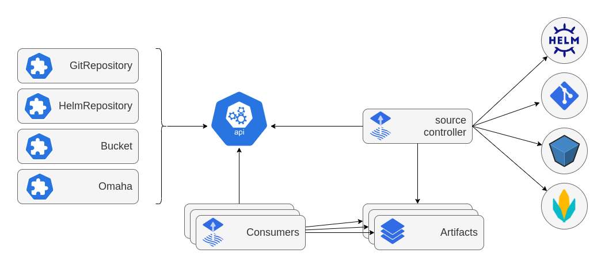

# Source controller

 
The source-controller is a Kubernetes operator, specialised in artifacts acquisition
from external sources such as Git, Helm repositories and S3 buckets.
The source-controller implements the
[source.toolkit.fluxcd.io](https://github.com/fluxcd/source-controller/tree/main/docs/spec/v1beta2) API
and is a core component of the [GitOps toolkit](https://fluxcd.io/flux/components/).

Features:

* authenticates to sources (SSH, user/password, API token)
* validates source authenticity (PGP)
* detects source changes based on update policies (semver)
* fetches resources on-demand and on-a-schedule
* packages the fetched resources into a well-known format (tar.gz, yaml)
* makes the artifacts addressable by their source identifier (sha, version, ts)
* makes the artifacts available in-cluster to interested 3rd parties
* notifies interested 3rd parties of source changes and availability (status conditions, events, hooks)
* reacts to Git push and Helm chart upload events (via [notification-controller](https://github.com/fluxcd/notification-controller))
