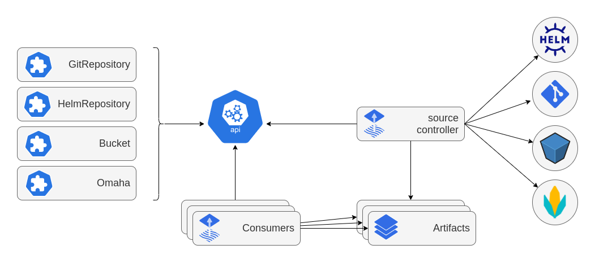

# Source controller

## About this fork

This fork is used by the
[qdrant-cloud-agent](https://github.com/qdrant/qdrant-cloud-agent/). The main
reason behind forking the upstream project is to be able to distribute the CRDs of this
project without risk of collision in case the customer is using Flux CD in their
K8s cluster. The main change between the fork and upstream consist of renaming the
API group names, replacing the ones from fluxcd (ex: `source.toolkit.fluxcd.io`)
by our custom ones.

### Maintaining the fork up to date

- Configure and fetch upstream/main.
- Create your development branch from origin/main and merge upstream/main into
  it. You can run the merge with `-X theirs` option.
- Solve the git conflicts if any.
- As there might be new files or content added in upstream, we might need to
  rename groups again. You can do that executing
  `./scripts/rename-api-groups.sh`.
- Run `go mod tidy` to clean up the dependencies and execute the tests of the project with `make test`.
- Ideally, they are passing. Otherwise, you need to work on fixing any possible
  issue.
- Push your development branch. After that, you would need to test it using it
  in the cloud-agent to confirm everything works as expected.
- Once you confirm it works fine, create a PR for review.
- **Note for the reviewer:** The merge commit from upstream/main doesn't make
  sense to review it. Focus on the commits with the changes relevant for the
  project.

---

The source-controller is a Kubernetes operator, specialised in artifacts acquisition
from external sources such as Git, OCI, Helm repositories and S3-compatible buckets.
The source-controller implements the
[source.toolkit.fluxcd.io](docs/spec/README.md) API
and is a core component of the [GitOps toolkit](https://fluxcd.io/flux/components/).

## APIs

| Kind                                                  | API Version                   |
|-------------------------------------------------------|-------------------------------|
| [GitRepository](docs/spec/v1/gitrepositories.md)      | `source.toolkit.fluxcd.io/v1` |
| [OCIRepository](docs/spec/v1/ocirepositories.md)      | `source.toolkit.fluxcd.io/v1` |
| [HelmRepository](docs/spec/v1/helmrepositories.md)    | `source.toolkit.fluxcd.io/v1` |
| [HelmChart](docs/spec/v1/helmcharts.md)               | `source.toolkit.fluxcd.io/v1` |
| [Bucket](docs/spec/v1/buckets.md)                     | `source.toolkit.fluxcd.io/v1` |
| [ExternalArtifact](docs/spec/v1/externalartifacts.md) | `source.toolkit.fluxcd.io/v1` |

## Features

* authenticates to sources (SSH, user/password, API token, Workload Identity)
* validates source authenticity (PGP, Cosign, Notation)
* detects source changes based on update policies (semver)
* fetches resources on-demand and on-a-schedule
* packages the fetched resources into a well-known format (tar.gz, yaml)
* makes the artifacts addressable by their source identifier (sha, version, ts)
* makes the artifacts available in-cluster to interested 3rd parties
* notifies interested 3rd parties of source changes and availability (status conditions, events, hooks)
* reacts to Git, Helm and OCI artifacts push events (via [notification-controller](https://github.com/fluxcd/notification-controller))

## Guides

* [Get started with Flux](https://fluxcd.io/flux/get-started/)
* [Setup Webhook Receivers](https://fluxcd.io/flux/guides/webhook-receivers/)
* [Setup Notifications](https://fluxcd.io/flux/guides/notifications/)
* [How to build, publish and consume OCI Artifacts with Flux](https://fluxcd.io/flux/cheatsheets/oci-artifacts/)

## Roadmap

The roadmap for the Flux family of projects can be found at <https://fluxcd.io/roadmap/>.

## Contributing

This project is Apache 2.0 licensed and accepts contributions via GitHub pull requests.
To start contributing please see the [development guide](DEVELOPMENT.md).
